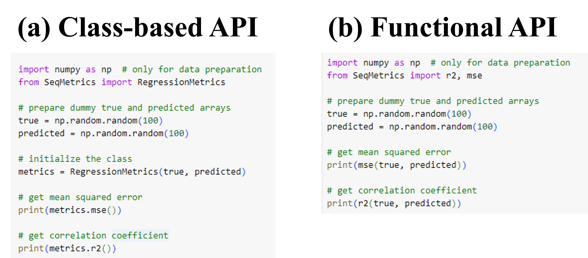

# Summary
Current python infrastructure lacks a robust, unified and simplified library for 
error and performance metrics calculations. The SeqMetrics application responds 
to this critical need, providing a robust toolkit for evaluating regression and 
classification models with a comprehensive suite of performance metrics suitable 
for tabular and time series data. Designed for versatility, the library offers 
112 regression and 22 classification metrics through both functional and 
class-based APIs. The design of the library ensures seamless integration into 
various coding environments. The web based GUI of SeqMetrics enhances user 
accessibility, allowing efficient input through data arrays or file imports. 
It serves to users of varied programming expertise, offering a user-friendly 
interface for rigorous model assessment. The library prioritizes computational 
efficiency and has minimal dependency with straightforward pip installation 
from PyPI. Rigorous testing of Seqmetrics ensures robustness, supported by extensive 
documentation for effective utilization by people from diverse backgrounds. 
Overall, SeqMetrics bridges the gap in Python's scientific analysis toolkit, 
contributing to data analysis.

# Statement of need
Performance metrics and errors measure the distance and similarity between 
two arrays [@Botchkarev]. Quantification and analysis of model performance 
through error and performance metrics is a crucial step in any scientific 
modeling exercise [@Gleckler2008]. However, Python 
lacks a unified library encompassing performance metrics across diverse fields
for one-dimensional numerical data. 
Existing Python libraries for performance evaluation offer only a limited number of metrics. 
For instance, the metrics sub-module from Keras [@chollet2015keras] contains only 24 metrics, 
while scikit-learn's [@pedregosa2011scikit] metrics module covers 45 metrics. Torchmetrics library, [@detlefsen2022torchmetrics] 
offers over 100 metrics. However, it provides only 48 which are intended
for 1-dimensional numerical data. There are also some subject-specific
libraries such as NeuralHydrology [@Kratzert2022], hydroeval [@hydroeval2021] and HydroErr [@wade2018hydroerr], however these resources
lack more general set of metrics which the experts in these demoains often require. 
Addressing this gap is imperative to provide 
researchers a unified platform for 
comprehensive model evaluation, streamlining their computational workflows and 
enhancing accuracy across various domains. The SeqMetrics application addresses 
the critical need for a robust and versatile toolkit for assessing and comparing 
regression and classification models performance across a spectrum of domains. 
With a comprehensive suite of performance metrics for sequential (tabular and 
time series) data, spanning traditional statistical measures to specialized 
atmospheric sciences metrics, the software serves as a valuable resource for 
researchers, analysts, and practitioners in fields such as hydrology, finance, 
and engineering.   By providing a standardized platform for evaluating model performance 
through a diverse set of metrics, the application facilitates the rigorous 
validation and optimization of regression and classification models, contributing 
to informed decision-making processes and ensuring the reliability of predictive 
modeling in complex and dynamic systems.

# API design
The SeqMetrics library offers a comprehensive suite of 112 regression metrics 
and 22 classification metrics to facilitate a detailed assessment of model performance. 
The regression metrics are for the data with continuous values such as R-squared, 
Mean Squared Error, and Root Mean Squared Error etc. On the other hand, the 
classification metrics are for categorical data which include accuracy, 
precision, recall, F1 score, and the area under the ROC curve among others. 
From programming perspective, the SeqMetrics library employs a modular architecture, 
offering a functional and class-based APIs for smooth integration across diverse 
coding environments. The class-based API, consists of ‘RegressionMetrics’ and 
‘ClassificationMetrics’ classes (Figure 1a), which provide users with a structured 
approach for model evaluation. The user has to first initialize these classes by 
providing the data and then all the performance metrics are available from the 
respect instances of the classes. Conversely, the functional API, offers a more 
simplified approach to access these metrics without initializing the classes 
initially (Fig. 1b). All the functions which calculate performance metrics 
receive two arrays as obligatory input arguments and return a scaler value 
as output. With a unified API design and minimal dependency only on NumPy, 
the library prioritizes efficiency in computational tasks. It ensures 
straightforward installation via pip from the Python Package Index (PyPI), 
a widely adopted standard, which not only streamlines the process but also
contributes to the overall efficiency of the application for the broader 
scientific community.



# Graphical User Interface
The SeqMetrics graphical user interface (GUI) offers a user-friendly and intuitive 
platform for seamless error calculation. This interface is built and deployed using 
streamlit at https://seqmetrics.streamlit.app . There are 2 ways of providing input 
in this web-based GUI. The first method includes 
providing it the input data arrays by copying and pasting the true and predicted 
arrays (Fig. 2). Another way is by importing CSV or Excel /files into the 
interface (Fig 3). This streamlines the process of entering true and predicted 
values for evaluation. The GUI provides a clean and organized layout, guiding 
users through the evaluation workflow with clear instructions. With its simplicity 
and ease of use, the GUI empowers users to perform regression and classification 
model assessments effortlessly. Whether you're a seasoned data scientist or a 
beginner, the SeqMetrics GUI enhances accessibility and efficiency in evaluating 
model performance without compromising on robustness and precision. Therefore, 
the design of the SeqMetrics is equally beneficial for advanced programmers as 
well as for those with limited programming knowledge. 


The streamlit-based GUI can also be launched locally without having to upload
the data on streamlit servers. This can be useful for users with data-privacy
concerns or those without internet connection. The steps to launch streamlit GUI
locally involve cloning the respository, isntalling the requirements and streamlit
python package and then launching the streamlit app. These steps are given below

```markdown

    git clone https://github.com/AtrCheema/SeqMetrics.git
    cd SeqMetrics
    pip install requirements.txt
    pip install streamlit
    streamlit run app.py

```

# Testing and documentation
Following the ‘unit test’ protocol the library undergoes comprehensive testing 
of all regression and classification metrics. The library is tested for multiple 
scenarios especially for classification case which includes numerical and logits 
inputs, ensuring robustness in various classification contexts such as binary, 
multiclass, and multilabel. Such comprehensive testing ensures the robustness and 
accuracy of each metric, providing users with reliable results. Additionally, 
the library features extensive documentation, with detailed docstrings for each 
function and class, accompanied by fully executable examples. This thorough 
documentation enhances user understanding and facilitates efficient utilization 
of the library's capabilities in both regression and classification scenarios.

# References
